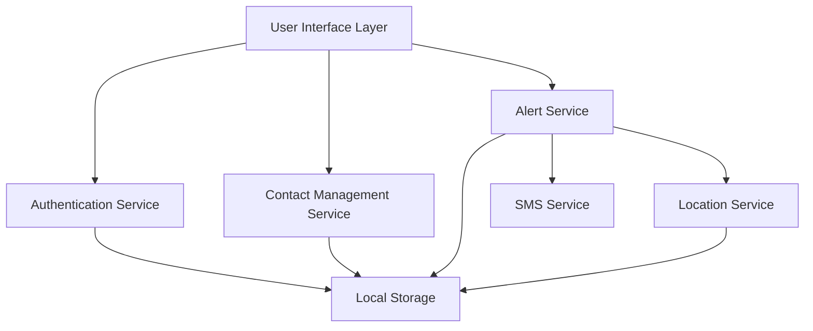

# Design Document: Women Safety Alert Application

## Overview

The Women Safety Alert application is a mobile safety solution built with a focus on reliability, speed, and simplicity. The system architecture prioritizes immediate response capabilities through a panic button mechanism that triggers real-time location sharing and automated SMS alerts to pre-registered emergency contacts.

The application follows a layered architecture with clear separation between the user interface, business logic, and data persistence layers. The design emphasizes offline capability for core functions, with intelligent queuing and retry mechanisms for network-dependent operations.

## Architecture

The application uses a client-side mobile architecture with the following key principles:

- **Offline-first design**: Core panic button functionality works without network connectivity
- **Immediate response**: Panic button activation provides instant feedback and queues alerts
- **Resilient communication**: Multiple retry mechanisms for SMS delivery and location updates
- **Secure data handling**: End-to-end encryption for sensitive user information
- **Battery optimization**: Efficient GPS usage and background processing

### System Components



## Components and Interfaces

### Authentication Service

**Purpose**: Manages user authentication, session management, and security verification.

**Key Methods**:
- `authenticate(email: string, password: string): Promise<AuthResult>`
- `createAccount(email: string, password: string): Promise<User>`
- `isAuthenticated(): boolean`
- `logout(): void`
- `requireRecentAuth(): Promise<boolean>`

**Security Features**:
- Password hashing using industry-standard algorithms
- Session token management with automatic expiration
- Biometric authentication support where available
- Account lockout protection against brute force attacks

### Contact Management Service

**Purpose**: Handles emergency contact registration, validation, and management.

**Key Methods**:
- `addContact(name: string, phoneNumber: string): Promise<Contact>`
- `updateContact(id: string, contact: Contact): Promise<Contact>`
- `deleteContact(id: string): Promise<void>`
- `getContacts(): Promise<Contact[]>`
- `validatePhoneNumber(phoneNumber: string): boolean`

**Business Rules**:
- Maximum 5 emergency contacts per user
- Phone number validation with international format support
- Duplicate contact prevention
- Minimum 1 contact required for panic button activation

### Alert Service

**Purpose**: Orchestrates emergency alert workflows, coordinates location capture and SMS delivery.

**Key Methods**:
- `triggerPanicAlert(): Promise<AlertResult>`
- `getAlertHistory(): Promise<Alert[]>`
- `retryFailedAlerts(): Promise<void>`
- `cancelActiveAlert(alertId: string): Promise<void>`

**Alert Workflow**:
1. Capture current GPS coordinates
2. Generate alert message with user info and location
3. Queue SMS messages for all emergency contacts
4. Provide immediate user feedback
5. Retry failed deliveries with exponential backoff

### Location Service

**Purpose**: Manages GPS functionality, location permissions, and coordinate accuracy.

**Key Methods**:
- `getCurrentLocation(): Promise<Coordinates>`
- `requestLocationPermissions(): Promise<PermissionStatus>`
- `isLocationEnabled(): boolean`
- `formatLocationForSMS(coordinates: Coordinates): string`

**Location Features**:
- High-accuracy GPS with 10-meter precision target
- Fallback to network-based location when GPS unavailable
- Location caching for offline scenarios
- Battery-optimized location updates

### SMS Service

**Purpose**: Handles SMS message composition, delivery, and retry logic.

**Key Methods**:
- `sendEmergencyAlert(contacts: Contact[], message: string): Promise<SMSResult[]>`
- `formatAlertMessage(user: User, location: Coordinates, timestamp: Date): string`
- `retryFailedSMS(messageId: string): Promise<SMSResult>`

**SMS Features**:
- Template-based message formatting
- Delivery status tracking
- Automatic retry with exponential backoff (up to 3 attempts)
- Queue management for offline scenarios

## Data Models

### User Model
```typescript
interface User {
  id: string;
  email: string;
  passwordHash: string;
  createdAt: Date;
  lastLoginAt: Date;
  isActive: boolean;
}
```

### Contact Model
```typescript
interface Contact {
  id: string;
  userId: string;
  name: string;
  phoneNumber: string;
  isVerified: boolean;
  createdAt: Date;
  updatedAt: Date;
}
```

### Alert Model
```typescript
interface Alert {
  id: string;
  userId: string;
  triggeredAt: Date;
  location: Coordinates | null;
  status: 'pending' | 'sent' | 'failed' | 'cancelled';
  smsResults: SMSResult[];
  retryCount: number;
}
```

### Coordinates Model
```typescript
interface Coordinates {
  latitude: number;
  longitude: number;
  accuracy: number;
  timestamp: Date;
}
```

### SMS Result Model
```typescript
interface SMSResult {
  contactId: string;
  phoneNumber: string;
  status: 'pending' | 'sent' | 'failed';
  sentAt: Date | null;
  errorMessage: string | null;
  retryCount: number;
}
```

## Correctness Properties

*A property is a characteristic or behavior that should hold true across all valid executions of a system—essentially, a formal statement about what the system should do. Properties serve as the bridge between human-readable specifications and machine-verifiable correctness guarantees.*

### Property 1: Authentication Behavior
*For any* user credentials, the authentication system should grant access if and only if the credentials are valid, and maintain session state until explicit logout
**Validates: Requirements 1.2, 1.3, 1.4**

### Property 2: Contact Management Operations
*For any* valid contact information, adding, updating, or deleting contacts should correctly persist changes and maintain data integrity
**Validates: Requirements 2.1, 2.3, 2.4**

### Property 3: Panic Button Alert Workflow
*For any* panic button activation, the system should immediately capture location, send alerts to all contacts, and provide user feedback
**Validates: Requirements 3.1, 3.2, 3.3, 3.4**

### Property 4: Location Accuracy
*For any* alert trigger, captured GPS coordinates should meet the 10-meter accuracy requirement when GPS is available
**Validates: Requirements 4.2**

### Property 5: Real-time Location Updates
*For any* active alert session, location data should be continuously updated and shared with emergency contacts
**Validates: Requirements 4.5**

### Property 6: SMS Delivery and Retry
*For any* emergency alert, SMS messages should be sent to all contacts within 30 seconds, with automatic retry up to 3 times for failures
**Validates: Requirements 5.1, 5.3**

### Property 7: SMS Message Content
*For any* emergency alert, SMS messages should include user name, timestamp, and location coordinates in a consistent format
**Validates: Requirements 5.2**

### Property 8: Network Resilience
*For any* network connectivity issues, alerts should be queued and delivered when connection is restored
**Validates: Requirements 6.3, 6.5**

### Property 9: Data Encryption
*For any* stored user data, all personal information and contact details should be encrypted using secure algorithms
**Validates: Requirements 8.1**

### Property 10: Authentication Verification
*For any* sensitive operation, the system should require recent authentication verification before allowing access
**Validates: Requirements 1.5, 8.4**

## Error Handling

The application implements comprehensive error handling across all critical paths:

### Authentication Errors
- Invalid credentials result in clear error messages without revealing system details
- Account lockout protection prevents brute force attacks
- Session expiration is handled gracefully with re-authentication prompts

### Location Service Errors
- GPS unavailable scenarios trigger fallback to network-based location
- Location permission denied results in user prompts with clear instructions
- Location accuracy below threshold triggers retry mechanisms

### SMS Delivery Errors
- Failed SMS delivery triggers automatic retry with exponential backoff
- Complete delivery failure is logged and user is notified
- Network unavailable scenarios queue messages for later delivery

### Data Persistence Errors
- Database write failures trigger retry mechanisms
- Data corruption is detected through integrity checks
- Backup and recovery mechanisms protect against data loss

## Testing Strategy

The testing approach combines unit testing for specific scenarios with property-based testing for comprehensive coverage:

### Unit Testing Focus
- Specific user workflows and edge cases
- Integration points between services
- Error conditions and boundary cases
- UI component behavior and accessibility

### Property-Based Testing Configuration
- **Framework**: Use fast-check for JavaScript/TypeScript or Hypothesis for Python
- **Test Iterations**: Minimum 100 iterations per property test
- **Test Tagging**: Each property test references its design document property
- **Coverage**: All 10 correctness properties implemented as property-based tests

### Test Categories

**Authentication Tests**:
- Unit tests for login/logout flows, password validation, session management
- Property tests for authentication behavior across all credential combinations

**Contact Management Tests**:
- Unit tests for contact validation, limit enforcement, duplicate prevention
- Property tests for CRUD operations across all valid contact data

**Alert System Tests**:
- Unit tests for panic button UI, message formatting, delivery confirmation
- Property tests for alert workflow across all user/contact configurations

**Location Service Tests**:
- Unit tests for permission handling, GPS fallback, accuracy validation
- Property tests for location capture and sharing across different scenarios

**SMS Service Tests**:
- Unit tests for message templates, delivery status, retry logic
- Property tests for SMS delivery across all contact and network conditions

**Integration Tests**:
- End-to-end alert workflows from panic button to SMS delivery
- Offline/online transition scenarios
- Cross-service data consistency validation

The dual testing approach ensures both specific edge cases are covered (unit tests) and universal correctness properties hold across all inputs (property tests), providing comprehensive validation of the safety-critical functionality.